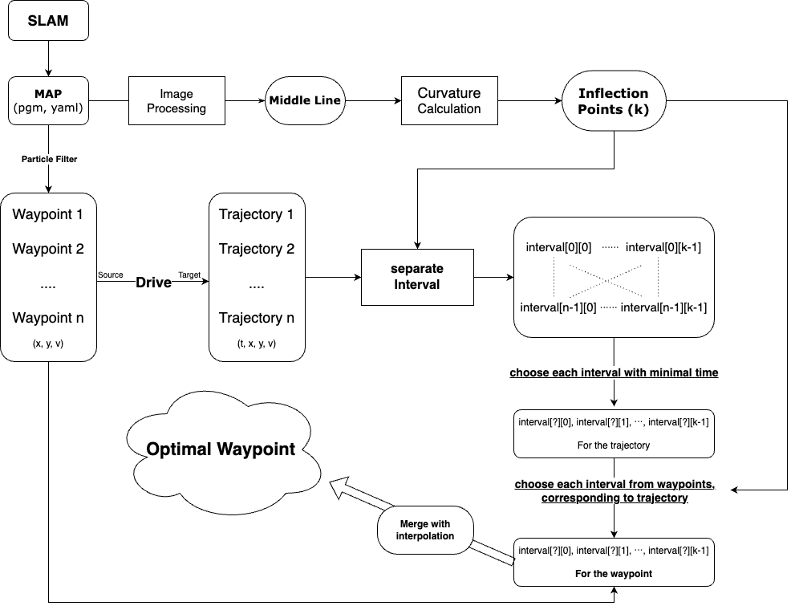

# GlobalPath-optimization
Global Path Optimizer using minimal-lap time based merging.
This optimizer is focused on [F1Tenth](https://f1tenth.org/).
 

# Optimization Flow

# Usage

## I. Get the inflection points.

It is important to divide a trajectory in order to meaningful merge. 
We thought distinguising which is straight line or curve is the matter.  Therefore, you should find inflection points of the map.
 

### 1. Get the Map

You should have your own map to be used for getting middle line and way points.

We recommand to use [SLAM Toolbox](https://github.com/SteveMacenski/slam_toolbox) to generate the map.

- You can refer how to generate the map with LiDAR from the [lecture of UPenn](https://docs.google.com/presentation/d/1HjCjyzHnR3T5yyXvdR83Kpb1lSvYX7gtirBwFY0Cpig/edit#slide=id.p).
- Also you can learn about **SLAM** via this [material](https://docs.google.com/presentation/d/165G1zMMUtOqU7GOnKvmEjpn0K1Bqw0ZlDAA2VFHgLmo/edit#slide=id.g2bcbd44bc16_0_821).
 

## 2. Get the Middline

If you get your map, you can extract the middle line of the map. 
 We used **map_converter** in [Raceline-Optimization](https://github.com/CL2-UWaterloo/Raceline-Optimization?tab=readme-ov-file).
 

## 3. Find inflection points

### 1) Curvature

Based on the middle line, you can extract proper inflection points using curvature.

The curvature $\kappa$ of a general curve $y = f(x)$ is defined as follows:

$$
\kappa = \frac{y''}{(1 + (y')^2)^{3/2}}
$$

where $y'$ is the first derivative of $f(x)$, and $y''$ is the second derivative.

**However, Since a car track does not follow the general form $y = f(x)$** but rather $x = x(t)$ and $y = y(t)$, we need to use the following curvature calculation formula:

$$
\kappa = \frac{\left| x' y'' - y' x'' \right|}{\left( (x')^2 + (y')^2 \right)^{3/2}}
$$

where $x'$ and $y'$ are the first derivatives with respect to $t$, and $x''$ and $y''$ are the second derivatives with respect to $t$.

### 2) What is meaningful inflection points?

After getting curvatre corresponding to each point, we select points when the sign of curvature is changed. It can separate each interval (straight line, curve)
 

## 2. Separate a trajectory into intervals

With inflection points, you can divide a trajectory into some intervals. If there are $k$ points, there will be $k$ intervels. Repeat this process for whole trajectoies.

**After this process, there will be $n * k$ intervals.**  

$$
\mathbf{Intervals} = \begin{pmatrix}
interval[0][0] & \cdots & interval[0][k-1] \\
\vdots & \ddots & \vdots \\
interval[n-1][0] & \cdots & interval[n-1][k-1]
\end{pmatrix}
$$

Also, each interval has its own period time, that is, how long does it take to pass the interval.
 

## 3. Find the minimal-time interval 

With interval time, you can select which interval is fastest. 

$$
\mathbf{Intervals} = \begin{pmatrix}
\text{interval}[m][0] & \text{interval}[m][1] & \cdots & \text{interval}[m][k-1]
\end{pmatrix} \quad \text{when } 0 \leq m < n
$$